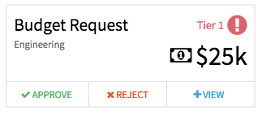

## Synopsis: Approve Reject Card

This widget can be used to create a simple approval card with three button **Accept**, **Reject**, **View**.

***

## Installation

Installation is very simple, you can just download the update set **pe-approve-reject-card-update-set.xml** and install it on your instance. Then the widget is available for you to drag and drop on your page.

We provide a single option to fill the card with sample data:

**"Card Data"** the default message for this is a sample JSON object.

***

