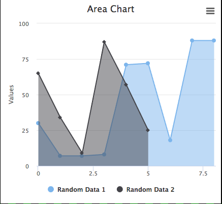
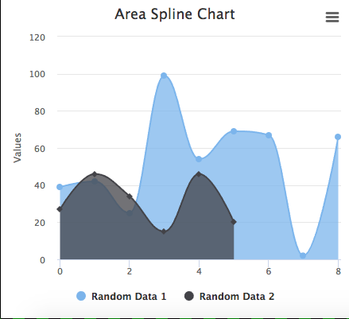

## Synopsis: Area Chart

This is used to create a simple Area Chart, Or a Area Spline Chart

## Installation

Installation is very simple, you can just download the update set "pe-contact-slider-update-set.xml" and install it on your instance. Then the widget is available for you to drag and drop on your page.

## Configuration