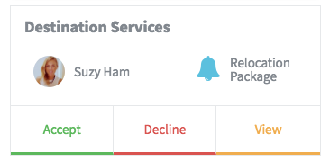

# Approval Card

## Description

This widget can be used to create a simple approval card with three button **Accept**, **Reject**, **View**. This widget also displays user avatar, name and title etc.

## Screenshots

## Additional Information/Notes

This widget makes use of [pe-people-info widget](https://github.com/platform-experience/serviceportal-widget-library/tree/master/people-card/pe-people-info) to display user avatar, name and title.

> Widget is included with the update set.

People Info widget is injected dynamically in client controller.

---
## Installation
---
Download and install update set **[pe-approval-card-with-approval-table.u-update-set.xml](https://github.com/platform-experience/serviceportal-widget-library/blob/master/approve-card/pe-approval-card-with-approval-table/pe-approval-card-with-approval-table.u-update-set.xml)**   
After installation, the widget can be accessed via the `Service Portal > Widgets` section for use and customization. 
* SN Product Documentation - ['Load a customization from a single XML file'](https://docs.servicenow.com/bundle/kingston-application-development/page/build/system-update-sets/task/t_SaveAnUpdateSetAsAnXMLFile.html)

---
## Configuration
---
Widget Option Schema parameters:

**"title"**  `Default: Destination Services` 
**"purpose"**   `Default: Relocation Package` 
**"icon"** Use of font-awesome icons for this option  `Default: fa fa-bell fa-2x`, which is a bell icon. Can be replaced with any supported glyph/icon using the [fontawesome.io](http://fontawesome.io/cheatsheet/) classes.

---
## Platform Dependencies
---
> None
---
## Sample Data and Data Structures
---
> See 'Configuration' above
---
## API Dependencies
---
<i>Dependencies are included and configured as part of the provided Update Set.</i>
> None
---
## CSS/SASS Variables
---
_CSS/SASS variables are given default values that can be overridden with theming or portal-level CSS._

`$pe-brand-success: #5cb85c !default;` 
`$pe-brand-warning: #f0ad4e !default;` 
`$pe-brand-danger: #d9534f !default;` 
`$pe-brand-info: #5bc0de !default;` 