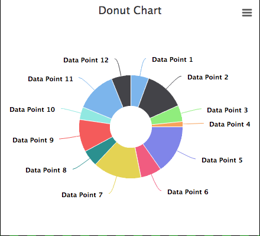

# Donut Chart

## Description

This widget can be used to represent data in a simple Donut Chart.

## Screenshots

## Additional Information/Notes
> None
---
## Installation
Download and install update set **[pe-donut-chart.u-update-set.xml](https://github.com/platform-experience/serviceportal-widget-library/blob/master/donut-widgets/pe-donut-chart/pe-donut-chart.u-update-set.xml)**   
After installation, the widget can be accessed via the `Service Portal > Widgets` section for use and customization. 

* SN Product Documentation - ['Load a customization from a single XML file'](https://docs.servicenow.com/bundle/istanbul-application-development/page/build/system-update-sets/task/t_LoadCustomizationsFromAnXMLFile.html)

---
## Configuration
Widget Option Schema parameters:

**"Title"** the default message for this is **Donut Chart** 
**"Active Color"** this is the color of the part representing the information we want to display 
**"Background Color"** 
**"Font Awesome Icon"** this is the style for the icon available from http://fontawesome.io/icons/ 

> To modify the percentage value, it is required to modify the CSS elements in *@keyframes donut-chart-1 {* **stroke-dashoffset** from 0 (100%) to the value of the circumference.

---
## Platform Dependencies
> None
---
## Sample Data and Data Structures
> None
---
## API Dependencies
<i>Dependencies are included and configured as part of the provided Update Set.</i>

* HighCharts API (v 5.0.5 - Recommended)  w/Export and No Data plug-ins
   Latest version(s) available from [HighCharts.com](http://http://www.highcharts.com/products/highcharts/)
   Additional HighCharts Utility - [highcharts-ng](https://github.com/pablojim/highcharts-ng) - Angular Directive for HighCharts (__not used or distributed__)

---
## CSS/SASS Variables
_CSS/SASS variables are given default values that can be overridden with theming or portal-level CSS._
> None
