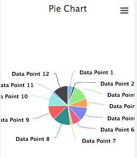
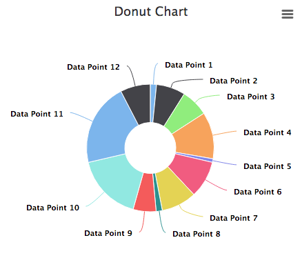
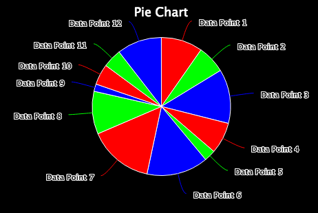
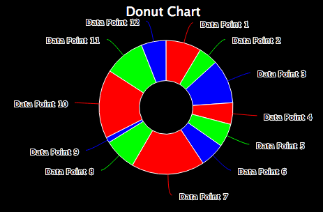

## Synopsis: Pie/Donut Chart




This is used to create a simple Pie Chart, or Donut Chart

## Installation

Installation is very simple, you can just download the update set "pe-pie-chart.u-update-set.xml" and install it on your instance. Then the widget is available for you to drag and drop on your page.

## Configuration
We provide some options to configure the widget.

1. **"Update Interval"** This is how often you would like the data in the chart to be updated.

1. **"Table"** The table to aggregate upon. If this is filled in the Script Include Option is not needed and will be ignored.

1. **"Fields"** The fields to get a count of for the aggregation.

1. **"Encoded Query"** The encoded query to for specifying the data returned, otherwise all data from a data will be returned.

1. **"Script Include"** Instead of using a table to gather data this can be used to get specific calculated data or more advanced data sets. By default this value is "PEHighchartsExample" this is mostly for demo purposes.

1. **"Function"** A specific function to use in the selected script include. By default this is "getDemoData". This is for demo purposes.

1. **"Parameter1"** A parameter to send to the selected script include and function combination.

1. **"Advance"** A JSON block. For setting specific attributes of the chart. All attributes that are editable can be found here [Highcharts Documentation](http://api.highcharts.com/highcharts). A example of this is as follows.
```json
{
    "title":{
        "text":"Pie Chart",
        "style":{
            "color":"white"
        }
    },
    "options":{
        "colors": ["rgba(255, 0, 0,1)", "rgba(0, 255, 0,1)", "rgba(0, 0, 255,1)"],
        "exporting":{
            "enabled":false
        },
        "chart":{
            "backgroundColor":null,
            "margin": [2, 0, 2, 0],
            "borderWidth":0,
            "height":310
        }
		},
		"legend":{
			"enabled":false
		}
}
```


In order to make a Pie Chart into a Donut Chart add the following to the "Advance" option. The percentage of the innerSize property will make the whole bigger or smaller.
```json
{
    "options":{
		"plotOptions":{
			"pie":{
				    "innerSize":"40%"
			    }
		    }
	    }
    }
}
```
