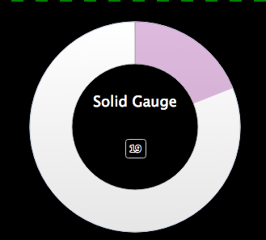
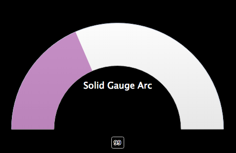

## Solid Gauge Chart

## Description

This is used to create a simple Solid Gauge, or Solid Gauge Arc

## Screenshots





## Additional Information/Notes 
> None
---
## Installation
---
Download and install update set **[pe-solid-gauge.u-update-set.xml](pe-solid-gauge.u-update-set.xml)** <br/><br/>
After installation, the widget can be accessed via the `Service Portal > Widgets` section for use and customization.<br/>
* SN Product Documentation - ['Load a customization from a single XML file'](https://docs.servicenow.com/search?q=Load+a+customization+from+a+single+XML+file)   (<i>Select appropriate instance version</i>)

---
## Configuration
---
Widget Option Schema parameters:

**"Update Interval"** Chart refresh interval.<br/>
**"Table"** Table from which to aggregate the data. `Overrides the Script Include parameter`<br/>
**"Fields"** Table fields used for the aggregation of data.<br/>
**"Encoded Query"** The encoded query limit the data returned.  `All data returned if empty.`<br/>
**"Script Include"** Used to get specific calculated data or more advanced data sets. By default this value is `"PEHighchartsExample"` for demo purposes. `Overridden if the 'Table' parameter is used.`<br/>
**"Function"** Function defined in the Script Include. `Default: "getDemoData"` for demo purposes<br/>
**"Parameter1"** A parameter passed/sent to the Script Include and Function combination.<br/>
**"Advance"** A JSON block; used to set specific attributes of the chart. All attributes that are editable can be found here [Highcharts Documentation](http://api.highcharts.com/highcharts). <br/>

Example:
```json
{
	"options":{
		"pane":{
			"background":{
				"shape":"solid",
				"innerRadius": "60%",
				"outerRadius": "100%"
			}
		},
		"chart":{
			"backgroundColor":null,
       "margin": [2, 0, 2, 0],
       "borderWidth":0,
       "height":310,
			"width":310
		},
		"exporting":{
			"enabled":false
		}
	},
	"yAxis":{
		"min":0,
		"max":100,
		"minColor":"rgba(128,0,128,.1)",
		"maxColor":"rgba(128,0,128,1)",
		"tickAmount":0,
		"tickWidth":0,
		"tickPositions":[]
	},
	"title":{
		"text":"Solid Gauge",
		"y":120,
		"style":{
			"color":"white"
		}
	}
}
```

To make a Solid Guage Arc chart the "Advance" option will need to be set like the following.

The startAngle and endAngle can be changed to make many variations of this arc and do not have to be equal either.

```json
{
	"options":{
		"pane":{
		"startAngle": -90,
		"endAngle": 90,
		"background":{
			"shape":"arc",
		}
	}
}
```


---
## Platform Dependencies
---
> None
---
## Sample Data and Data Structures
---
> None
---
## API Dependencies
---
<i>Dependencies are included and configured as part of the provided Update Set.</i>

* HighCharts API (v 5.0.5 - Recommended)  w/Export and No Data plug-ins
  <br/>Latest version(s) available from [HighCharts.com](http://http://www.highcharts.com/products/highcharts/)
  <br/>Additional HighCharts Utility - [highcharts-ng](https://github.com/pablojim/highcharts-ng) - Angular Directive for HighCharts (__not used or distributed__)

---
## CSS/SASS Variables
---
_CSS/SASS variables are given default values that can be overridden with theming or portal-level CSS._
> None
