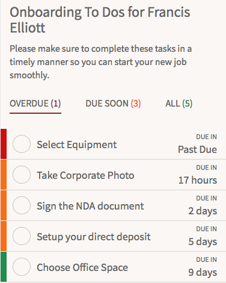

# HR Case Detail

## Description

At the genesis of the onboarding process, an employee is presented a list of to-dos with this HR Service Portal widget.

## Screenshot

## Additional Information/Notes

Uses ServiceNow® [Employee Service Center](https://docs.servicenow.com/bundle/kingston-hr-service-delivery/page/product/human-resources/concept/c_UseTheHRSMPortal.html) (HR Service Portal)

## Platform Dependencies

### SN System Tables

> None

## Sample Data and Data Structures

> See 'Configuration' above

## CSS/SASS Variables

_CSS/SASS variables are given default values that can be overridden with theming or portal-level CSS._

> None