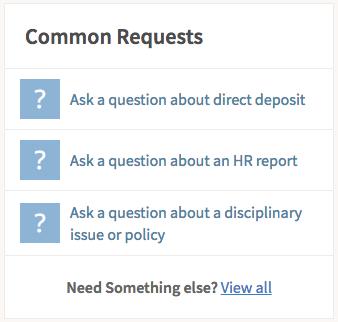

# HR Catalog List

## Description

Display a list of common requests with this HR Service Portal widget.

## Screenshot

## Additional Information/Notes

Uses ServiceNow® [Employee Service Center](https://docs.servicenow.com/bundle/kingston-hr-service-delivery/page/product/human-resources/concept/c_UseTheHRSMPortal.html) (HR Service Portal)

## Configuration

### Widget Option Schema

| Option | Description | Default Value |
| :--- | :--- | :--- |
| `Catalog` | Sets the widget catalog. |  |
| `Limit to` | Max number of items to display. |  |
| `Title` | Sets the widget title. |  |

## Platform Dependencies

### SN System Tables

> None

## Sample Data and Data Structures

> See 'Configuration' above

## CSS/SASS Variables

_CSS/SASS variables are given default values that can be overridden with theming or portal-level CSS._

> None