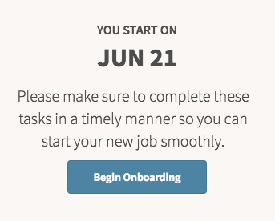

# HR Employee Next Task

## Description

## Screenshot

## Additional Information/Notes

Uses ServiceNow® [Employee Service Center](https://docs.servicenow.com/bundle/kingston-hr-service-delivery/page/product/human-resources/concept/c_UseTheHRSMPortal.html) (HR Service Portal)

## Configuration

## Platform Dependencies

### SN System Tables

> None

## Sample Data and Data Structures

> See 'Configuration' above

## API Dependencies

*Dependencies are included and configured as part of the provided Update Set.*

> None

## CSS/SASS Variables

_CSS/SASS variables are given default values that can be overridden with theming or portal-level CSS._

> None