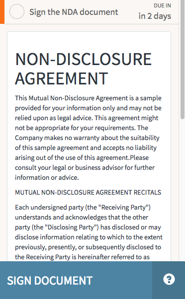
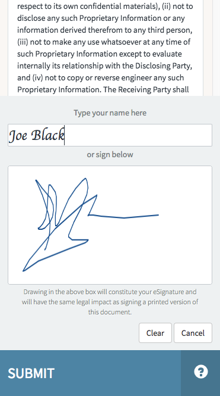

# HR Sign Document

## Description

As a task in the onboarding process, an employee reads a non-disclosure agreement and signs a document with this HR Service Portal widget.

## Screenshots

### Read Non-Disclosure

### Sign Document

## Additional Information/Notes

Uses ServiceNow® [Employee Service Center](https://docs.servicenow.com/bundle/kingston-hr-service-delivery/page/product/human-resources/concept/c_UseTheHRSMPortal.html) (HR Service Portal)

## Platform Dependencies

### SN System Tables

> None

## Sample Data and Data Structures

> See 'Configuration' above

## CSS/SASS Variables

_CSS/SASS variables are given default values that can be overridden with theming or portal-level CSS._

> None