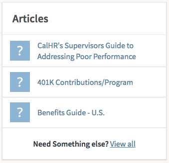

# HR Simple List

## Description

Display a list of articles with this HR Service Portal widget.

## Screenshot

## Additional Information/Notes

Uses ServiceNow® [Employee Service Center](https://docs.servicenow.com/bundle/kingston-hr-service-delivery/page/product/human-resources/concept/c_UseTheHRSMPortal.html) (HR Service Portal)

## Configuration

### Widget Option Schema

| Option | Description | Default Value |
| :--- | :--- | :--- |
| `Table` | Sets the widget table. |  |
| `Filter` | Set the table filter. |  |
| `Display field` | Sets the display field. |  |
| `Secondary fields` | Sets the secondary display field. |  |
| `List page` | Used to set the page. |  |
| `Link to this page` | Used to set the page link. |  |
| `Show even when empty` | Option to show on empty. |  |
| `View` | Sets the article view. |  |
| `Glyph` | Option to set glyph icon. |  |
| `Bootstrap color` | Sets the Bootstrap color. |  |
| `Bootstrap size` | Sets the Bootstrap size. |  |
| `Maximum entries` | Max number of article entries. |  |
| `List body height` | Sets the body height. |  |
| `Image field` | Sets the image field. |  |
| `Rounded images` | Option to display rounded images. |  |
| `Hide Footer` | Option to hide footer. |  |

## Platform Dependencies

### SN System Tables

> None

## Sample Data and Data Structures

> See 'Configuration' above

## API Dependencies

*Dependencies are included and configured as part of the provided Update Set.*

> None

## CSS/SASS Variables

_CSS/SASS variables are given default values that can be overridden with theming or portal-level CSS._

> None