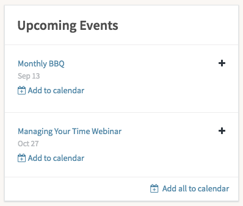
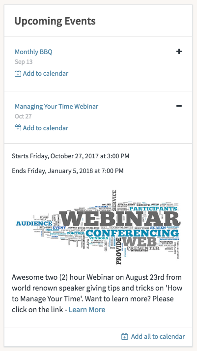

# HR Upcoming Events

## Description

View upcoming events from company management with this HR Service Portal widget.

## Screenshots

### Collapsed

### Expanded

## Additional Information/Notes

Uses ServiceNow® [Employee Service Center](https://docs.servicenow.com/bundle/kingston-hr-service-delivery/page/product/human-resources/concept/c_UseTheHRSMPortal.html) (HR Service Portal)

## Configuration

### Widget Option Schema

| Option | Description | Default Value |
| :--- | :--- | :--- |
| `HR widget instance name` | Sets the widget instance. |  |

## Platform Dependencies

### SN System Tables

> None

## Sample Data and Data Structures

> See 'Configuration' above

## CSS/SASS Variables

_CSS/SASS variables are given default values that can be overridden with theming or portal-level CSS._

> None