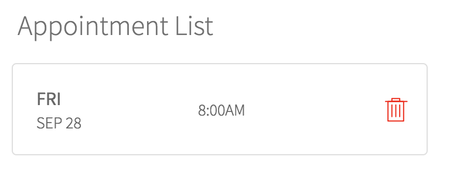

# PE Appointment List

## Description

This widget is used to display the appointments scheduled through widget **[PE Appointment Scheduling](https://github.com/platform-experience/serviceportal-widget-library/pe-appointment-scheduling)**.

## Screenshot

## Additional Information/Notes

## Installation

Download and install update set in **[PE Appointment Scheduling](https://github.com/platform-experience/serviceportal-widget-library/pe-appointment-scheduling)**

After installation, **Appointment List** can be accessed via the `Service Portal > Widgets` section for use and customization.

* SN Product Documentation - ['Load a customization from a single XML file'](https://docs.servicenow.com/bundle/kingston-application-development/page/build/system-update-sets/task/t_SaveAnUpdateSetAsAnXMLFile.html)

## Configuration

### Widget Option Schema

| Option | Description |
| :--- | :--- | :--- |
| `Title` | Give the widget a Title that will appear above the widget. |
| `Task Appointment Definition` | Set the Task Appointment record to use from step 1. |
| `Show short description` | If you would like to collect Short Description when creating appointments, check the applicable box(s). |
| `Show location` | If you would like to collect Location info when creating appointments, check the applicable box(s). |

## Platform Dependencies

### SN System Tables

> None

## Sample Data and Data Structures

> See 'Configuration' above

## Dependencies

* [PE Appointment List](https://github.com/platform-experience/serviceportal-widget-library/blob/master/pe-appointment-list)

## CSS/SASS Variables

_CSS/SASS variables are given default values that can be overridden with theming or portal-level CSS._

**`$icon-color`**

