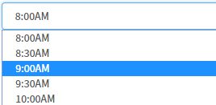
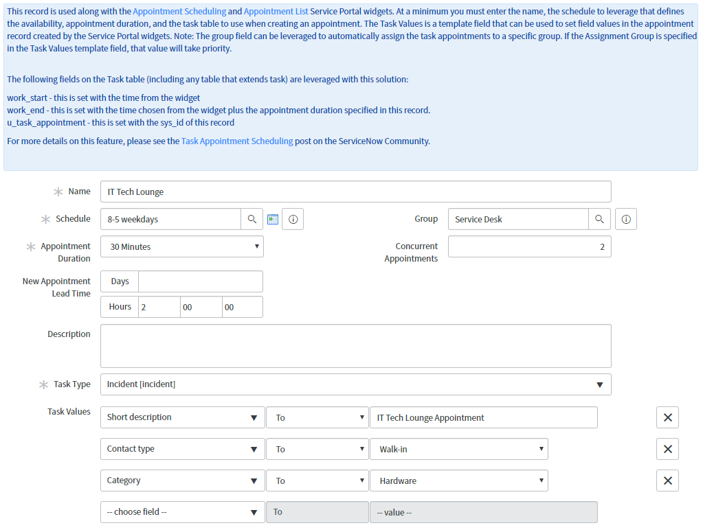

# PE Appointment Scheduling

## Description

This provides a "no-code" solution of defining how appointments should be scheduled and Service Portal widgets to allow users to schedule new appointments and view their existing appointments.

## Screenshot

## Additional Information/Notes

The ServiceNow platform offers several features that make this solution possible:

* **Feature Rich Task Table:**
The task table is the base table for most applications within ServiceNow.   Incident, Problem, Change, Case, etc all extend Task.This table includes common attributes for any type of task/case and extending it speeds up development time and it brings many features along with it such as SLAs, On-Call Scheduling, etc.
The task table includes Start and End attributes that various applications leverage for the scheduling of work.   Because of this, this Task Appointment Scheduling solution can be applied to any application within your instance that extends the task table.

* **Service Portal:**
The Service Portal, introduced in the Helsinki release, has brought a whole new dynamic of creating responsive and feature rich UI's that improves the usability of ServiceNow.
Using AnjularJS and Bootstrap, reusable widgets can be created that can be easily leveraged on any page within your Service Portals.
The Service Portal widget is reusable in that each instance of the widget is tied to Task Appointment Definition record.   So you could have two widgets on a page where one creates an Incident appointment while another one creates a Change appointment.

This Task based solution that allows you to:

* Define a schedule for accepting appointments and a duration of time for each appointment
* Set which Task table to use to store the appointments.   This can be any table that extends task, including out of the box tables like Incident, Problem, Change, Case, etc, or any custom table.
* Set how many concurrent appointments that can be scheduled before marking an appointment time unavailable.   Default is 1.
* Set template values that will be applied when the appointment record is created.
* Set the style of how you want the available appointments to be presented within the Service Portal:

**Timecard View**

**Chicklet View**

**Dropdown view**

## Installation

Download and install update set **[pe-appointment.u-update-set.xml](https://github.com/platform-experience/serviceportal-widget-library/blob/master/pe-appointment-scheduling/ppe-appointment.u-update-set.xml)**

After installation, 2 new widgets **Appointment Scheduling** and **[Appointment List](https://github.com/platform-experience/serviceportal-widget-library/blob/master/pe-appointment-list)** can be accessed via the `Service Portal > Widgets` section for use and customization.

* SN Product Documentation - ['Load a customization from a single XML file'](https://docs.servicenow.com/bundle/kingston-application-development/page/build/system-update-sets/task/t_SaveAnUpdateSetAsAnXMLFile.html)

## Configuration

After committing the update set, Navigate to Task Appointments\Task Appointments and click New.

* Give it a name
* Set the schedule for the time frame that you wish to accept appointments and the duration of the appointments.   You may need to create a new schedule if you don't already have one defined that matches the appointment schedule.
* Optionally set the New Appointment Lead Time if you prefer to set a buffer on when the next available appointment can be scheduled.  For example if you set this value to 1 hour, the next available slot will be one hour from the current time assuming it is available.
* Optionally set a group you wish to route the appointments to and set the number of concurrent appointments this group can accept.   You can also set the group in the Task Values instead.   The task values will override the value set in the Group field.
* Set the Task table used to store the appointment records
* Use the Task Values template field to set any other fields in the task record such as short description, assignment group, category, etc which is applied as an appointment is created.
* Click Submit.

### Widget Option Schema

| Option | Description |
| :--- | :--- | :--- |
| `Title` | Give the widget a Title that will appear above the widget. |
| `Task Appointment Definition` | Set the Task Appointment record to use from step 1. |
| `Layout Options` | Choose the layout of how you want to display the available appointments.   See a screenshot of the options above. |
| `Allow Reminders` | Set whether you wish to allow reminders to be sent prior to an appointment |
| `Maximum avialable dates` | Set the maximum number of days out that you wish to allow appointments.   Default is 30 days |
| `Show description` |If you would like to collect Description when creating appointments, check the applicable box(s). |
| `Show short description` | If you would like to collect Short Description when creating appointments, check the applicable box(s). |
| `Show location` | If you would like to collect Location info when creating appointments, check the applicable box(s). |

**As mentioned earlier, [Appointment List](https://github.com/platform-experience/serviceportal-widget-library/pe-appointment-list) is part of the update set already. This shows the list of appointments, if you have any**

## Platform Dependencies

### SN System Tables

> Task

## Sample Data and Data Structures

> See 'Configuration' above

## Dependencies

* [PE Appointment List](https://github.com/platform-experience/serviceportal-widget-library/pe-appointment-list)

## CSS/SASS Variables

_CSS/SASS variables are given default values that can be overridden with theming or portal-level CSS._

**`$time-slot-text`**

**`$time-slot-bg`**
