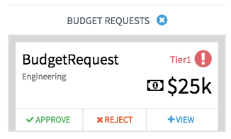

## Synopsis: Approve Reject Inbox

This widget can be used to create a simple expandable inbox containing cards.

***

## Installation

Installation is very simple, you can just download the update set **pe-approve-reject-inbox-update-set.xml** and install it on your instance. Then the widget is available for you to drag and drop on your page.

We provide a single option to to fill the inbox with a sample card:

**"Card Data"** the default message for this is a sample JSON object.

***

