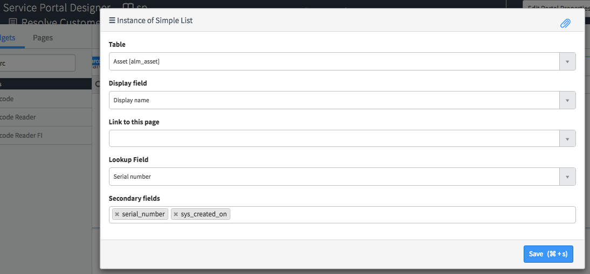
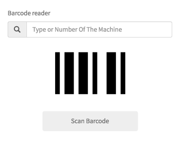
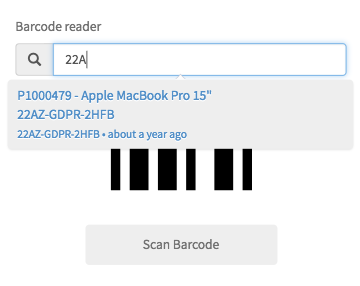

# Barcode Reader FI

## Description
This widget can be used to read a bar code in different formats or to manually enter it, providing a backend lookup just specifying table name and lookup column in the options.
The image can be provided straight from camera or camera roll/file system (mobile and desktop).

## Screenshots
 <br/><br/>
 <br/><br/>
 <br/><br/>
<br/>
<br/>
<i>With manual lookup:</i><br/><br/>
 <br/>

## Additional Information/Notes
> None
---
## Installation
Download and install update set **[pe-barcode-reader-fi.u-update-set.xml](https://github.com/platform-experience/serviceportal-widget-library/blob/master/pe-barcode-reader-fi/pe-barcode-reader-fi.u-update-set.xml)** <br/><br/>
After installation, the widget can be accessed via the `Service Portal > Widgets` section for use and customization.<br/>
* SN Product Documentation - ['Load a customization from a single XML file'](https://docs.servicenow.com/bundle/jakarta-application-development/page/build/system-update-sets/task/t_SaveAnUpdateSetAsAnXMLFile.html)

---
## Configuration
Language variants can be created through the section System UI -> UI Messages and displayed adding in the HTML body a statement with the syntax:

```html
${<i>key value specified in the Message record</i>}
```

### Widget Option Schema

**"Table"**  the table containing the products/items to search for<br/>
**"Display field"**  the column name with the value to display on UI<br/>
**"Lookup field"**  the column name containing the barcode<br/>
**"Additional fields"**  additional columns to display on UI<br/>

---
## Platform Dependencies
> None
---
## Sample Data and Data Structures
> See 'Configuration' above
---
## API Dependencies
* QuaggaJS <br/>
<i>Dependencies are included and configured as part of the provided Update Set.</i>
---
## CSS/SASS Variables
The widget is using colors from Bootstrap SASS variables, and a minimal style configuration to make it easy to customize.
_CSS/SASS variables are given default values that can be overridden with theming or portal-level CSS._
