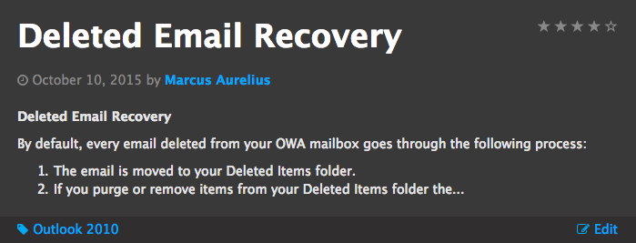
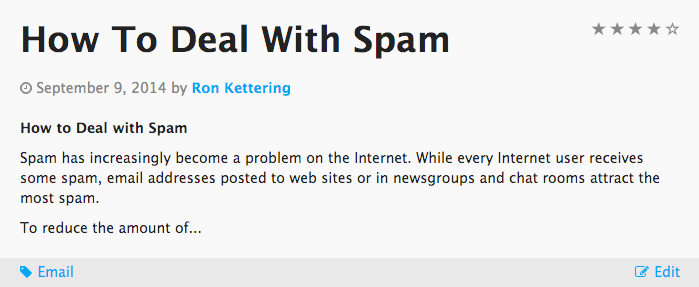

# Blog

## Description

A simple blog widget crafted from Knowledge Base articles with configurable options.

## Screenshots

### Dark Theme


### Light Theme


## Additional Information/Notes
> None

---

## Installation

Download and install update set **[pe-blog.u-update-set.xml](https://github.com/platform-experience/serviceportal-widget-library/blob/master/pe-blog/pe-blog.u-update-set.xml)** <br/><br/>
After installation, the widget can be accessed via the `Service Portal > Widgets` section for use and customization.<br/>
* SN Product Documentation - ['Load a customization from a single XML file'](https://docs.servicenow.com/bundle/jakarta-application-development/page/build/system-update-sets/task/t_SaveAnUpdateSetAsAnXMLFile.html)

---

## Configuration

### Widget Option Schema

| Option | Description | Default Value |
| :--- | :--- | :--- |
| `KB category` | Sets the blog category. | Email |
| `Max entries` | Sets the maximum number of blog entries. | 5 |
| `Excerpt character limit` | Defines the blog excerpt character limit. | 300 |
| `Theme` | Sets the blog theme. Three options: Dark, Dracula and Light. | Light |
| `Edit role` | Selects the role that will be able to view the edit button. | admin |
| `Display excerpt` | Used to show or hide the excerpt. | Checked |
| `Display ratings` | Used to show or hide the ratings. | Checked |

---

## Platform Dependencies

### Tables
* kb_knowledge
* u_sp_blog_instance

---

## Sample Data and Data Structures

> See 'Configuration' above

---

## API Dependencies

<i>Dependencies are included and configured as part of the provided update set.</i>
> None

---

## CSS/SASS Variables

_CSS/SASS variables are given default values that can be overridden with theming or portal-level CSS._

```scss
$pe-light-theme-header: #222 !default;
$pe-dark-theme-header: #fff !default;
$pe-dracula-theme-header: #bd93f9 !default;
$pe-sub-header-color: #777 !default;
$pe-anchor-color: #03a9f4 !default;
$pe-font-size: 1.5rem !default;
```