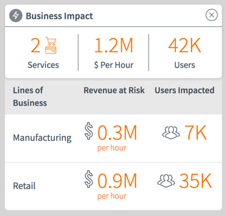

## Title - Business Impact Details

## Description - Use Case

Query the most recent anonaly alert from the *em_alert_anomaly* table to provide Business Services Impact Details.

## Screenshots

## Additional Information/Notes 
Included as part of the update set **[pe-business-impact.u-update-set.xml](../pe-business-impact/pe-business-impact.u-update-set.xml)**   

---
## Installation
---
See README for **[pe-business-impact](../pe-business-impact/README.md)** 

---
## Configuration
---
Widget Option Schema parameters:

**alert_sysid**: Provide an anomaly alert's sys_id and data in the widget will display based on related records.
**titleIconClasses**: Provide a set of Font Awesome css classes for an icon to display next to the title. Defaults to `'fa fa-bolt'`.

---
## Platform Dependencies
---
### SN Plugin Support

See README for **[pe-business-impact](../pe-business-impact/README.md)** 

---
## CSS/SASS Variables
---
_CSS/SASS variables are given default values that can be overridden with theming or portal-level CSS._

`$slate: #485563;` 
`$orange: #ff6f00;` 
`$medium-green: #34ba3d;` 
`$icon-circle-color: #7e848b !default;` 
`$text-color: $slate !default;` 
`$divider-color: #7E848B !default;` 
`$status-alert-color: $orange !default;` 
`$status-recovered-color: $medium-green !default;` 