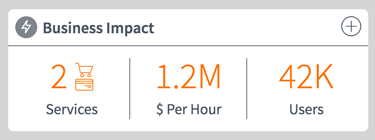
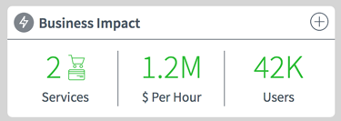

## Title - Business Impact

## Description - Use Case

Query the most recent anonaly alert from the *em_alert_anomaly* table to provide Business Services impact information and associated Business Services details.
Qhen the plus (+) graphic in the top right is selected/clicked, details about the Business Impact is displayed through use of the `pe-business-impact-details` widget (_included_).

## Screenshots
### Collapsed View

### Expanded View

### Resolved View

## Additional Information/Notes 
The update set installs two (2) widgets - PE Business Impact and PE Business Impact Details.
Though the PE Business Impact widget uses the PE Business Impact Details widget to display additional information about the alert anomaly, the details widget does not rely on the first widget in order to function, however; the data collected is passed to the details widget.  The PE Business Impact Details can be used separately when configured with an anomaly alert record's sys_id.

---
## Installation
---
Ensure the that the **Performance Analytics - Content Pack - Event Management** plugin is Activated per the SN Plugin support section below.  
Download and install update set **[pe-business-impact.u-update-set.xml](pe-business-impact.u-update-set.xml)**   
After installation, the widget can be accessed via the `Service Portal > Widgets` section for use and customization. 
* SN Product Documentation - ['Load a customization from a single XML file'](https://docs.servicenow.com/search?q=Load+a+customization+from+a+single+XML+file)   (<i>Select appropriate instance version</i>)

---
## Configuration
---
Widget Option Schema parameters:

1. **alert_sysid**: Provide an anomaly alert's sys_id and data in the widget will display based on related records.

1. **titleIconClasses**: Provide a set of Font Awesome css classes for an icon to display next to the title. Defaults to `'fa fa-bolt'`.

---
## Platform Dependencies
---
### SN Plugin Support

Widget support is provided by the ServiceNow® [Performance Analytics - Content Pack - Event Management](https://docs.servicenow.com/bundle/istanbul-performance-analytics-and-reporting/page/use/performance-analytics/reference/r_PALandingPage.html) 
Performance Analytics content pack for Event Management core out-of-the-box KPIs.  
**For Customers:** _Activation of this plugin on production instances may require a separate Performance Analytics license. Contact ServiceNow for details._

### SN System Tables
* cmdb_rel_type
* cmdb_ci
* cmdb_ci_service
* em_alert_anomaly

---
## Sample Data and Data Structures
---
With the Performance Analytics - Content Pack - Event Management installed. The System table *em_alert_anomoly* is created.  `This update set will install a sample record into the table.`

`NOTE`
There two (2) records provided as an insert or updates as part of the Update Set installation.
The record for the *em_alert_anomaly* is updated to create the necessary links/connections with the required CMDB tables.
Additionally, there is a single record created for the Event Type and added to the *em_event_type* table.

Revenue and User impact information is provided as 'demo only' data, and would need to be coordinated with an appropriate record attribute to be accurate.

---
## API Dependencies
---
<i>Dependencies are included and configured as part of the provided Update Set.</i>

None

---
## CSS/SASS Variables
---
_CSS/SASS variables are given default values that can be overridden with theming or portal-level CSS._

`$slate: #485563;` 
`$orange: #ff6f00;` 
`$medium-green: #34ba3d;` 
`$icon-circle-color: #7e848b !default;` 
`$text-color: $slate !default;` 
`$divider-color: #7E848B !default;` 
`$status-alert-color: $orange !default;` 
`$status-recovered-color: $medium-green !default;` 