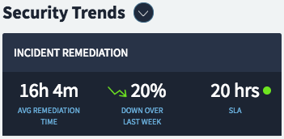

## Synopsis: Card Scroll Widget

This widget can be used to quickly craft a card that scrolls on toggle to display hidden content.

## Installation

Installation is very simple, you can just download the update set "pe-card-scroll.u-update-set.xml" and install it on your instance. Then the widget is available for you to drag and drop on your page.

## Sass Variables

We provide four Sass variables to control the theme & font colors.

`$pe-theme-color: #1c2432 !default;`

`$pe-header-color: #fff !default;`

`$pe-anchor-color: #68acd8 !default;`

`$pe-status-color-normal: #6ee520 !default;`