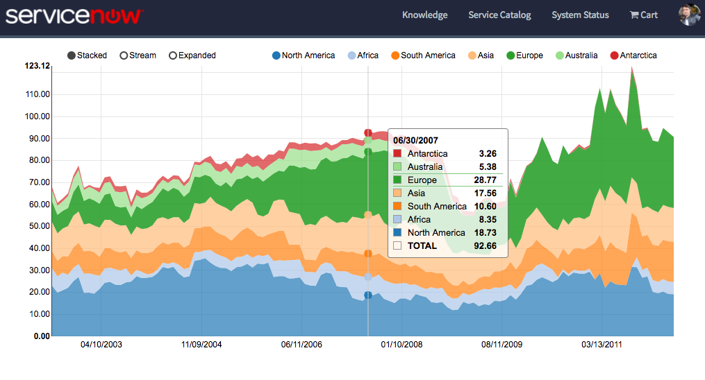

## Charts NVD3

## Description

This widget shows how it is simple to represent data using external libraries, easy to include within the ServiceNow platform. This widget is using the highest rated framework for building charts, that is NVD3.

## Screenshots

 
## Additional Information/Notes
> None
---
## Installation
---
Download and install update set **[pe-charts-nvd3.u-update-set.xml](pe-charts-nvd3.u-update-set.xml)**   
After installation, the widget can be accessed via the `Service Portal > Widgets` section for use and customization. 
* SN Product Documentation - ['Load a customization from a single XML file'](https://docs.servicenow.com/search?q=Load+a+customization+from+a+single+XML+file)   (<i>Select appropriate instance version</i>)
---
## Configuration
---
Widget Option Schema parameters: 
> None

---
## Platform Dependencies
---
> None

---
## Sample Data and Data Structures
> None

---
## API Dependencies
<i>Dependencies are included and configured as part of the provided Update Set.</i>
> None

---
## CSS/SASS Variables
The widget is using colors from Bootstrap SASS variables, and a minimal styles configuration to make it easy to customize and extend.
_CSS/SASS variables are given default values that can be overridden with theming or portal-level CSS._
