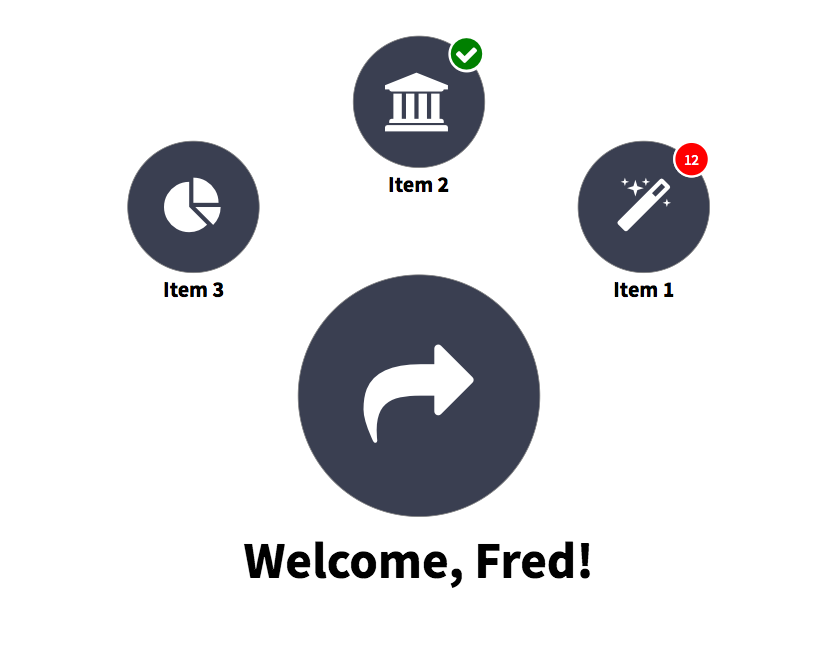
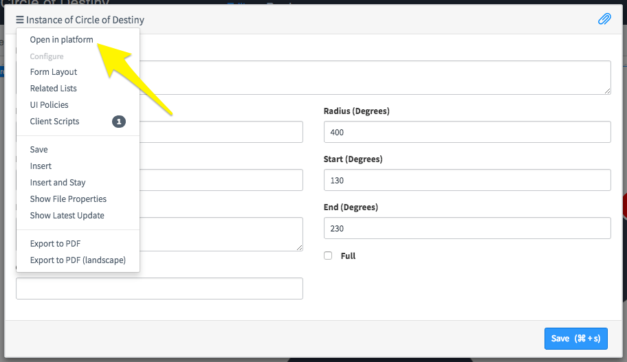
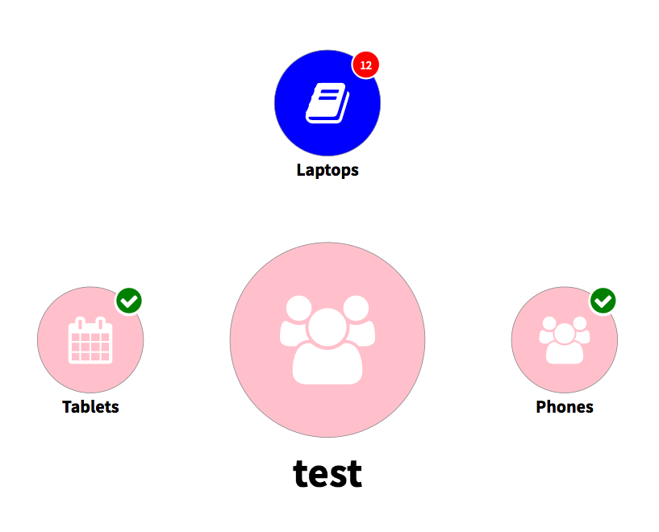

## Synopsis: Circle of Destiny



The Circle of Destiny widget allows you to create an element on your page which consists of a large central circle, surrounded by smaller circles.

All circles can have the following traits:

- Icon OR Image
- Label
- Hyperlink

The outer circles can have the following decorations added to them:

- Completion status (checkbox)
- Count

## Installation
Simply download the update set X and load it on your instance. The widget will then be available to be added to your page via drag and drop in the page designer.

## Configuration

There are a number of configuration options available.

- Radius: the radius of the circle on which the outer elements are placed.
- Start: the degree from the bottom middle at which the first element is placed.
- End: the degree from the bottom middle at which the last element is placed.
- Full: whether the circle is a complete circle. If it's a complete circle, we don't want to place an element on the last spot (as this would overlap the first).

To configure the elements in the circle of destiny (i.e. the surrounding circles) you need to click the hamburger menu in the options dialog and choose "Open in Platform".



There are many SASS variables which can be defined within your theme/page styles to configure the styling of the widget:

`$pe-cod-border-color: grey !default;`

`$pe-cod-inner-bg: #3a3f51 !default;`

`$pe-cod-inner-color: white !default;`

`$pe-cod-inner-label: black !default;`

`$pe-cod-inner-font-size: 70px !default;`

`$pe-cod-inner-icon-size: 150px !default;`

`$pe-cod-outer-bg: #3a3f51 !default;`

`$pe-cod-outer-color: white !default;`

`$pe-cod-outer-label: black !default;`

`$pe-cod-outer-font-size: 30px !default;`

`$pe-cod-outer-icon-size: 80px !default;`

`$pe-cod-count-color: white !default;`

`$pe-cod-count-bg: red !default;`

`$pe-cod-count-border: white !default;`

`$pe-cod-success-color: green !default;`

`$pe-cod-success-bg: white !default;`

## Programmatic Insertion

If you're embedding this widget programatically, you need to supply it input in JSON format. For example:

```
{
	label: 'test',
	icon: 'fa fa-users',
	url: 'https://www.gmail.com',
	color: 'pink',
	count: 30,
	items: [{
		label: 'Phones',
		url: 'https://www.google.com',
		icon: 'fa fa-users',
		completed: true
	},
	{
		label: 'Laptops',
		url: 'https://www.apple.com',
		icon: 'fa fa-book',
		completed: false,
		color: 'blue',
		count: 12
	},
	{
		label: 'Tablets',
		url: 'https://www.servicenow.com',
		icon: 'fa fa-calendar',
		completed: true
	}]
}
```
Using the above JSON would result in the below circle of destiny:

