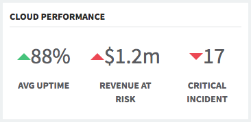

# Cloud Performance

## Description

A simple card used for displaying performance details and status.

## Screenshot

## Additional Information/Notes

> None

## Installation

Download and install update set **[pe-cloud-performance.u-update-set.xml](https://github.com/platform-experience/serviceportal-widget-library/blob/master/pe-cloud-performance/pe-cloud-performance.u-update-set.xml)**   
After installation, the widget can be accessed via the `Service Portal > Widgets` section for use and customization. 
* SN Product Documentation - ['Load a customization from a single XML file'](https://docs.servicenow.com/bundle/jakarta-application-development/page/build/system-update-sets/task/t_SaveAnUpdateSetAsAnXMLFile.html)

## Configuration

### Widget Option Schema

| Option | Description | Default Value |
| :--- | :--- | :--- |
| `Title` | Sets the header title. | Cloud Performance |

## Platform Dependencies

### SN System Tables

> None

## Sample Data and Data Structures

> See 'Configuration' above

## API Dependencies

*Dependencies are included and configured as part of the provided Update Set.*

> None

## CSS/SASS Variables

_CSS/SASS variables are given default values that can be overridden with theming or portal-level CSS._

> None