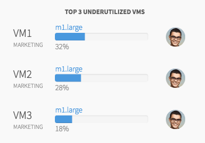

## Synopsis: Card Utilization Snippet


This snippet can be used to quickly obtain a card containing sub sections with data and a sample charts.

## Installation

Installation is very simple, you can just download the update set **pe-cloud-sprawl-card-utilization-snippet.u-update-set.xml** and install it on your instance. Then the widget is available for you to drag and drop on your page.

A sample JSON object is defined in the client controller.

```javascript

c.company = {
    name: "AWS",
    icon: "#icon-aws",

    util_percent: "82%",
    underutil_percent: "10%",

    vm_list: [{
      vmnumber: "VM1",
      vm_number: "MARKETING",
      progress_text: "m1.large",
      progress: "32%",
      user: {
        fname: "jose",
        lname: "riley",
        name: "Jose Riley",
        photo: "fae1fa1013d07e00f7f5bcc32244b091.iix",
        title: "Application Manager",
        phone: "8581234567"

      }

    }, {
      vmnumber: "VM2",
      vm_number: "MARKETING",
      progress_text: "m1.large",
      progress: "28%",
      user: {
        fname: "jose",
        lname: "riley",
        name: "Jose Riley",
        photo: "fae1fa1013d07e00f7f5bcc32244b091.iix",
        title: "Application Manager",
        phone: "8581234567"

      }

    }, {
      vmnumber: "VM3",
      vm_number: "MARKETING",
      progress_text: "m1.large",
      progress: "18%",
      user: {
        fname: "jose",
        lname: "riley",
        name: "Jose Riley",
        photo: "fae1fa1013d07e00f7f5bcc32244b091.iix",
        title: "Application Manager",
        phone: "8581234567"

      }

    }],

  };

```