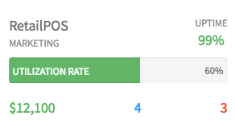

## Synopsis: Cloud Sprawl Overview Snippet



***

## Installation

Installation is very simple, you can just download the update set **pe-cloud-sprawl-overview-snippet.u-update-set.xml** and install it on your instance. Then the widget is available for you to drag and drop on your page.

There is one option with a sample data set.

**"Card Data"** the default value for this is a sample **JSON object**

```javascript
    {
      "title": "Retail POS",
      "sluged": "retail_pos",
      "sub_title": "Marketing",
      "right_percent": "98%",
      "type": "aws",
      "thumbs": "up",
      "progress": "60%",
      "bottom_dollor": "$12,100",
      "right_attn_count": "3",
      "right_attn_color": "red"
    }
```