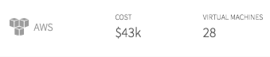

## Synopsis: Info Cost


This snippet can be used to quickly obtain a card containing sub sections with data and a sample charts.

## Installation

Installation is very simple, you can just download the update set **pe-cloud-sprawl-info-cost-snippet.u-update-set.xml** and install it on your instance. Then the widget is available for you to drag and drop on your page.

A sample JSON object is defined in the client controller.

```javascript

c.threetabs = {
    first_tab: {
      name: "Reclaimed VMs",
      badge_number: 13,
      badge_color: "bg-red",

      list: [{
        icon: "#icon-aws",
        company: "AWS",
        cost: "$43k",
        virtual_m: "28"
      }, {
        icon: "#icon-azure",
        company: "azure",
        cost: "$14k",
        virtual_m: "9"
      }, {
        icon: "#icon-vmware",
        company: "VMW",
        cost: "$12k",
        virtual_m: "9"
      }]


    },
    second_tab: {
      name: "expiring soon",
      badge_number: 5,
      badge_color: "bg-orange",
      list: [{
        icon: "#icon-aws",
        company: "AWS",
        lease: "Expires in 3 days",
        vimnumber: "VM10",
        vim_number: "REQ05001",
        user: {
          fname: "David",
          lname: "Hoffman",
          name: "David Hoffman",
          photo: "22d959621398fe00f7f5bcc32244b0d2.iix",
          title: "Application Manager",
          phone: "8581234567"

        }
      }, {

        icon: "#icon-aws",
        company: "AWS",
        lease: "Expires in 5 days",
        vimnumber: "VM20",
        vim_number: "REQ05001",
        user: {
          fname: "jose",
          lname: "riley",
          name: "Jose Riley",
          photo: "fae1fa1013d07e00f7f5bcc32244b091.iix",
          title: "Application Manager",
          phone: "8581234567"

        }
      }, {
        icon: "#icon-aws",
        company: "AWS",
        lease: "Expires in 10 days",
        vimnumber: "VM30",
        vim_number: "REQ05001",
        user: {
          fname: "greg",
          lname: "hill",
          name: "Greg Hill",
          photo: "743a51a21398fe00f7f5bcc32244b067.iix",
          title: "Application Manager",
          phone: "8581234567"

        }
      }, {
        icon: "#icon-azure",
        company: "Azure",
        lease: "Expires in 5 days",
        vimnumber: "VM40",
        vim_number: "REQ05001",
        user: {
          fname: "Andrew",
          lname: "Garner",
          name: "Jose Riley",
          photo: "90f8d5621398fe00f7f5bcc32244b00b.iix",
          title: "Application Manager",
          phone: "8581234567"

        }
      }, {
        icon: "#icon-vmware",
        company: "VMW",
        lease: "Expires in 10 days",
        vimnumber: "VM50",
        vim_number: "REQ05001",
        user: {
          fname: "edward",
          lname: "scott",
          name: "Edward Scott",
          photo: "47161dae1358fe00f7f5bcc32244b03c.iix",
          title: "IT Manager",
          phone: "8581234567"

        }
      }]
    },


    third_tab: {
      name: "new vms",
      badge_number: 10,
      badge_color: "bg-green",
      list: [{
        icon: "#icon-aws",
        company: "AWS",
        cost: "$27.6k/month",
        virtual_m: "5"
      }, {
        icon: "#icon-azure",
        company: "Azure",
        cost: "$13.8k/month",
        virtual_m: "3"
      }, {
        icon: "#icon-vmware",
        company: "VMW",
        cost: "$9.2k/month",
        virtual_m: "2"
      }]
    }
  }

```