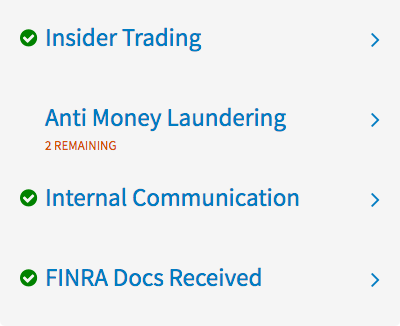
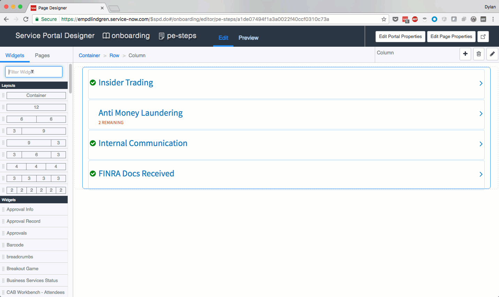

# Completion Task

## Description

This widget shows an individual task, the status of the task, and an optional message related to the task. When used multiple times on a page, it becomes a list of tasks, each of which can be given its own hyperlink to take you to another page.

## Screenshots



## Additional Information/Notes
The widget uses it's own custom widget instance table, `u_sp_instance_completion_task`.

<br/>Whether a task is completed is controlled by the evaluation of the "Validation script" (true/false). The message shown is also controlled by the return value of a script, in this case the "Warning message script". All widget options are configurable via the regular instance options editor. See screen recording below:


---
## Installation

Download and install update set **[pe-completion-task.u-update-set.xml](https://github.com/platform-experience/serviceportal-widget-library/blob/master/pe-completion-task/pe-completion-task.u-update-set.xml)** <br/><br/>
After installation, the widget can be accessed via the `Service Portal > Widgets` section for use and customization.<br/>
* SN Product Documentation - ['Load a customization from a single XML file'](https://docs.servicenow.com/bundle/jakarta-application-development/page/build/system-update-sets/task/t_SaveAnUpdateSetAsAnXMLFile.html)

---
## Configuration

### Widget Option Schema

| Option | Description | Default Value |
| :--- | :--- | :--- |
| `Validation script` | Sets validation script | script |
| `Warning message script` | Sets warning script | script |

---
## Platform Dependencies

### System Table

* u_sp_instance_completion_task
---
## Sample Data and Data Structures

> See 'Additional Information/Notes' above

---
## API Dependencies


<i>Dependencies are included and configured as part of the provided Update Set.</i>
> None
---
## CSS/SASS Variables

_CSS/SASS variables are given default values that can be overridden with theming or portal-level CSS._

```scss
$pe-ct-heading: #117fc1 !default;
$pe-ct-warning: #d35400 !default;
$pe-ct-arrow: #117fc1 !default;
$pe-ct-completed: green !default;
```