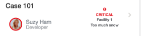

## Synopsis: PE CSM case row

This widget can be used to create a simple case card, with details like case number,person assigned, priority and short description.

***

## Installation

You can just download the update set **pe-csm-case-row.u-update-set.xml** and install it on your instance. Then the widget is available for you to drag and drop on your page. This widget includes.

**Important note: This widget makes use of [pe-people-info](https://github.com/platform-experience/serviceportal-widget-library/tree/master/People%20Card/pe-people-info) widget to display user avatar, name and title, this widget is already part of the update set.

People Info widget is injected dynamically in client controller.

## Configuration
Widget Option Schema parameters:

**User SysID** - Default: `9ec35b8713453a007e94fc5ed144b09a` 
**Show Only Picture** - Default: `false` 
**Show Job Title** -  Default: `true` 
**Show Call and Chat** -  Default: `false` 
**Header Title** - Demo value: `Case 101` 

***

