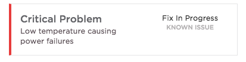

## Synopsis: PE CSM Case status

Widget support is provided by the ServiceNow® [Customer Service Management](https://docs.servicenow.com/bundle/istanbul-service-management-for-the-enterprise/page/product/customer-service-management/concept/c_CustomerServiceManagement.html ) application.  Additionally, if not loading customer specific demo data; the [Customer Service Management Demo Data](https://docs.servicenow.com/bundle/istanbul-service-management-for-the-enterprise/page/product/customer-service-management/reference/r_CustServMgmtAddtlPluginsTable.html#r_additionaltableplugins) plugin should be Activated.

Driven by **sn_customerservice_case** and **task_sla** tables, when a case sysid is provided in the Widget Schema options, the widget will fetch details from the record and the associated SLA for display.

***

## Installation

Ensure the that the Customer Service Management (and Demo Data, if necessary) application is Activated as referenced above.  
Download and installation of update set **[pe-csm-case-row.u-update-set.xml](pe-csm-case-row.u-update-set.xml)** includes this widget.
 After installation, the widget can be accessed via the Service Portal > Widgets section for use and customization.
* SN Product Documentation - ['Load a customization from a single XML file'](https://docs.servicenow.com/search?q=Load+a+customization+from+a+single+XML+file)   (<i>Select appropriate instance version</i>)

## Configuration

Widget Option Schema parameters:

**Case Table** - Default: `sn_customerservice_case` 
**SLA Table** - Default: `task_sla` 
**Case Sys ID** -  This is a case record sysid. Demo value: `cf866683c3033100b12d9f2974d3ae1f` 

***