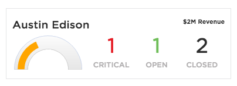

# PE CSM Dashboard Expandable

## Description

This widget can be used to display customer status. Clicking anywhere on the widget will show the extended view container, where you can include additional data or inject another widget (_not configured_).

## Screenshots

## Additional Information/Notes
This widget makes use of [pe-solid-gauge](https://github.com/platform-experience/serviceportal-widget-library/tree/master/highcharts/pe-solid-gauge), this widget is already part of the update set.

Solid Gauge is injected dynamically in client controller.

---
## Installation
---
Download and install update set **[pe-csm-dashboard-expandable.u-update-set.xml](https://github.com/platform-experience/serviceportal-widget-library/blob/master/pe-csm-dashboard-expandable/pe-csm-dashboard-expandable.u-update-set.xml)**   
After installation, the widget can be accessed via the `Service Portal > Widgets` section for use and customization. 
* SN Product Documentation - ['Load a customization from a single XML file'](https://docs.servicenow.com/bundle/jakarta-application-development/page/build/system-update-sets/task/t_SaveAnUpdateSetAsAnXMLFile.html)

---
## Configuration
---
Widget Option Schema parameters:
> None
---
## Platform Dependencies
---
> None
---
## Sample Data and Data Structures
---
> None
---
## API Dependencies
---
<i>Dependencies are included and configured as part of the provided Update Set.</i>
> None
---
## CSS/SASS Variables
---
_CSS/SASS variables are given default values that can be overridden with theming or portal-level CSS._
> None