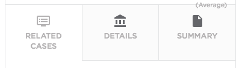

# PE CSM Dashboard Tabs

## Description

This widget can be used to create a simple tabbed menu.

## Screenshots

## Additional Information/Notes
> None
---
## Installation
---
Download and install update set **[pe-csm-dashboard-tabs.u-update-set.xml](https://github.com/platform-experience/serviceportal-widget-library/blob/master/pe-csm-dashboard-tabs/pe-csm-dashboard-tabs.u-update-set.xml)**   
After installation, the widget can be accessed via the `Service Portal > Widgets` section for use and customization. 
* SN Product Documentation - ['Load a customization from a single XML file'](https://docs.servicenow.com/bundle/jakarta-application-development/page/build/system-update-sets/task/t_SaveAnUpdateSetAsAnXMLFile.html)

---
## Configuration
---
Widget Option Schema parameters:

**"First Tab Title"** Title for first tab. 
**"First Tab Icon"** Icon for first tab. 
**"Second Tab Title"** Title for second tab. 
**"Second Tab Icon"** Icon for second tab. 
**"Third Tab Title"** Title for third tab. 
**"Third Tab Icon"** Icon for third tab. 

> For each **ICON** parameter, use the [fontawesome.io](http://fontawesome.io/cheatsheet/) classes.

---
## Platform Dependencies
---
> None
---
## Sample Data and Data Structures
---
> None
---
## API Dependencies
---
<i>Dependencies are included and configured as part of the provided Update Set.</i>
> None
---
## CSS/SASS Variables
---
_CSS/SASS variables are given default values that can be overridden with theming or portal-level CSS._
> None