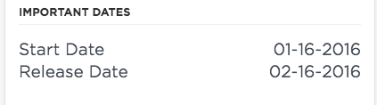

## Synopsis: PE CSm hot fix dates

This widget can be used to display important dates.

***

## Installation

You can just download the update set **pe-csm-hotfix-dates.u-update-set.xml** and install it on your instance. Then the widget is available for you to drag and drop on your page.

