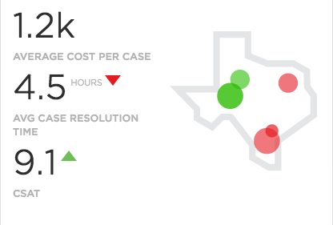

# NEEDS TO BE REVIEWED FURTHER

## Title - PE CSM Location

## Description - Use Case

This widget just displays `?? cot ??` and Map image.

## Screenshots

## Additional Information/Notes 
> None
---
## Installation
---
Download and install update set **[pe-csm-location.u-update-set.xml](pe-csm-location.u-update-set.xml)**   
After installation, the widget can be accessed via the `Service Portal > Widgets` section for use and customization. 
* SN Product Documentation - ['Load a customization from a single XML file'](https://docs.servicenow.com/search?q=Load+a+customization+from+a+single+XML+file)   (<i>Select appropriate instance version</i>)
---
## Configuration
---
Widget Option Schema parameters:
> None
---
## Platform Dependencies
---
> None
---
## Sample Data and Data Structures
---
> None
---
## API Dependencies
---
<i>Dependencies are included and configured as part of the provided Update Set.</i>
> None
---
## CSS/SASS Variables
---
_CSS/SASS variables are given default values that can be overridden with theming or portal-level CSS._
> None