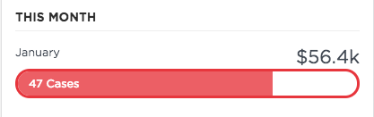

# PE CSM Progress Bar

## Description

This widget can be used to create a simple progress bar.

## Screenshots

## Additional Information/Notes
> None
---
## Installation
---
Download and install update set **[pe-csm-progress-bar.u-update-set.xml](https://github.com/platform-experience/serviceportal-widget-library/blob/master/pe-csm-progressbar/pe-csm-progress-bar.u-update-set.xml)**   
After installation, the widget can be accessed via the `Service Portal > Widgets` section for use and customization. 
* SN Product Documentation - ['Load a customization from a single XML file'](https://docs.servicenow.com/bundle/jakarta-application-development/page/build/system-update-sets/task/t_SaveAnUpdateSetAsAnXMLFile.html)

---
## Configuration
---
Widget Option Schema parameters:

**"Widget Header"** This is for the header. 
**"Progress Bar Left Text"** Left text on top of progress bar. 
**"Progress Bar Right Text"** Right text on top of progress bar. 
**"Progress Total"** Total value for which the progress is calculated. 
**"Progress value"** Actual progress out of total. 
 **"Progress Bar Text"** Text that goes on the progress bar. 
 **"Progress Bar Color"** Color of the bar the progress bar. 

---
## Platform Dependencies
---
> None
---
## Sample Data and Data Structures
---
> None
---
## API Dependencies
---
<i>Dependencies are included and configured as part of the provided Update Set.</i>
> None
---
## CSS/SASS Variables
---
_CSS/SASS variables are given default values that can be overridden with theming or portal-level CSS._
> None