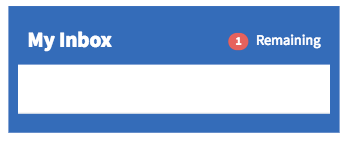

# NEEDS TO BE REVIEWED FURTHER

## Inbox

## Description

This widget can be used to quicly show a list of tabs, managin selection and with horizontal scrolling.

## Screenshots

## Additional Information/Notes
> None
---
## Installation
---

`Missing Update Set`

Download and install update set **[.u-update-set.xml](.u-update-set.xml)**   
After installation, the widget can be accessed via the `Service Portal > Widgets` section for use and customization. 
* SN Product Documentation - ['Load a customization from a single XML file'](https://docs.servicenow.com/bundle/istanbul-application-development/page/build/system-update-sets/task/t_LoadCustomizationsFromAnXMLFile.html)   (<i>Select appropriate instance version</i>)
---
## Configuration
---
Widget Option Schema parameters:

**"Title"** title text - `Default: My Inbox`

---
## Platform Dependencies
---
> None
---
## Sample Data and Data Structures
---
> None
---
## API Dependencies
---
<i>Dependencies are included and configured as part of the provided Update Set.</i>
> None
---
## CSS/SASS Variables
---
_CSS/SASS variables are given default values that can be overridden with theming or portal-level CSS._

`$pe-brand-widget-bg-color: #2f65bc !default;` 
`$pe-brand-widget-text-color: #e5efff !default;` 