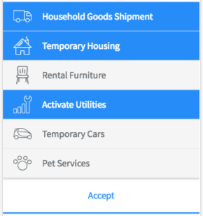

# Employee Experience Modal Snippet

## Description

This is the snippet to display list for services in employee experience.

## Screenshots

## Additional Information/Notes
> None
---
## Installation
---
Download and install update set **[pe-emp-exp-services-list-snippet.u-update-set.xml](https://github.com/platform-experience/serviceportal-widget-library/blob/master/pe-emp-exp-services-list-snippet/pe-emp-exp-services-list-snippet.u-update-set.xml)**   
After installation, the widget can be accessed via the `Service Portal > Widgets` section for use and customization. 
* SN Product Documentation - ['Load a customization from a single XML file'](https://docs.servicenow.com/bundle/kingston-application-development/page/build/system-update-sets/task/t_SaveAnUpdateSetAsAnXMLFile.html)

---
## Configuration
---
Widget Option Schema parameters:
> None
---
## Platform Dependencies
---
> None
---
## Sample Data and Data Structures
---
Sample data is provided as a JSON object in the Client Script file.

---
## API Dependencies
---
<i>Dependencies are included and configured as part of the provided Update Set.</i>
> None
---
## CSS/SASS Variables
---
_CSS/SASS variables are given default values that can be overridden with theming or portal-level CSS._

`$pe-blue-color: #268cf8 !default;`