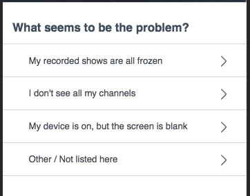

## Synopsis: End User Survey Widget

This can be used to quickly craft a list of survey like questions.

## Installation

Installation is very simple, you can just download the update set **pe-enduser-survey.u-update-set.xml** and install it on your instance. Then the widget is available for you to drag and drop on your page.

## Configuration

We provide 1 options to configure the widget.

1. **"question_id"** This is to specify a question that the widget should display the options of. The default is "f6d234ecdb9e32002e5df2b6ae9619b8".

