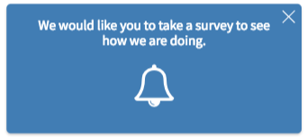
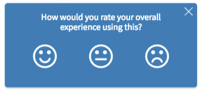
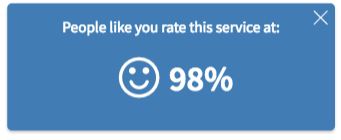

## Title - Feedback Card

## Description - Use Case

This widget can be used to create a simple emoji rating/feedback card.

## Screenshots

### Step 1

### Step 2

### Step 3

## Additional Information/Notes 
> None
---
## Installation
---
Download and install update set **[pe-feedback-card.u-update-set.xml](pe-feedback-card.u-update-set.xml)**   
After installation, the widget can be accessed via the `Service Portal > Widgets` section for use and customization. 
* SN Product Documentation - ['Load a customization from a single XML file'](https://docs.servicenow.com/search?q=Load+a+customization+from+a+single+XML+file)   (<i>Select appropriate instance version</i>)
---
## Configuration
---
Widget Option Schema parameters:

**"Step 1 message"**  `Default: We would like you to take a survey to see how we are doing.` 
**"Step 2 message"**  `Default: How would you rate your overall experience using this?` 
**"Step 3 message"**  `Default: People like you rate this service at:` 

---
## Platform Dependencies
---
> None
---
## Sample Data and Data Structures
---
> None
---
## API Dependencies
---
<i>Dependencies are included and configured as part of the provided Update Set.</i>
> None
---
## CSS/SASS Variables
---
_CSS/SASS variables are given default values that can be overridden with theming or portal-level CSS._

`$pe-brand-primary: #337ab7 !default;` 
`$pe-brand-text-color: #fff !default;` 
`$pe-brand-text-size-normal: 15px !default;` 