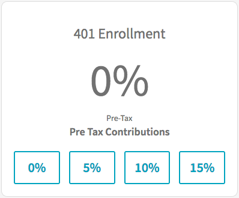

## Title - FOEXP 401k Enrollment

## Description - Use Case

This widget allows users to register their 401k contribution level. Simply clicking the buttons will register their contribution level.

## Screenshots

## Additional Information/Notes 

Update set installs the table '401k Enrollments' (u_401k_enrollments) with sample data.

---
## Installation
---
Download and install update set **[pe-foexp-401k-update-set.u-update-set.xml](pe-foexp-401k-update-set.u-update-set.xml)**   
After installation, the widget can be accessed via the `Service Portal > Widgets` section for use and customization. 
* SN Product Documentation - ['Load a customization from a single XML file'](https://docs.servicenow.com/search?q=Load+a+customization+from+a+single+XML+file)   (<i>Select appropriate instance version</i>)
---
## Configuration
---
Widget Option Schema parameters:
> None
---
## Platform Dependencies
---
> None
---
## Sample Data and Data Structures
---
Sample data is provided by the update set installed table '401k Enrollments' (u_401k_enrollments)

---
## API Dependencies
---
<i>Dependencies are included and configured as part of the provided Update Set.</i>
> None
---
## CSS/SASS Variables
---
_CSS/SASS variables are given default values that can be overridden with theming or portal-level CSS._

`button-bg: #ffffff !default;` 
`$button: #1aa5be !default;` 