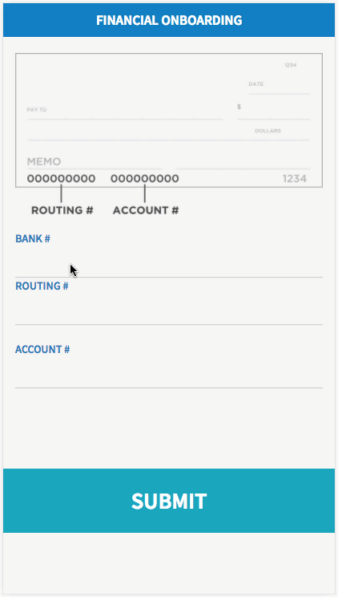

# FOEXP Debit Details

## Description

This widget allows a user to submit and modify their debit details.

## Screenshots

## Additional Information/Notes

Update set installs the table 'User Debit Details' (u_user_debit_details) with sample data.

---
## Installation
---
Download and install update set **[pe-foexp-debit-details.u-update-set.xml](https://github.com/platform-experience/serviceportal-widget-library/blob/master/pe-foexp-debit-details/pe-foexp-debit-details-update-set.u-update-set.xml)**   
After installation, the widget can be accessed via the `Service Portal > Widgets` section for use and customization. 
* SN Product Documentation - ['Load a customization from a single XML file'](https://docs.servicenow.com/bundle/kingston-application-development/page/build/system-update-sets/task/t_SaveAnUpdateSetAsAnXMLFile.html)

---
## Configuration
---
Widget Option Schema parameters:
> None
---
## Platform Dependencies
---
> None
---
## Sample Data and Data Structures
---
Sample data is provided by the update set installed table 'User Debit Details' (u_user_debit_details)

---
## API Dependencies
---
<i>Dependencies are included and configured as part of the provided Update Set.</i>
> None
---
## CSS/SASS Variables
---
_CSS/SASS variables are given default values that can be overridden with theming or portal-level CSS._
> None