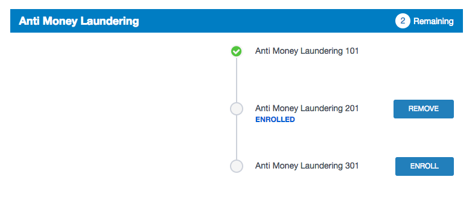

# Training widget (Financial Onboarding Experience)

## Description

This widget can be used to show training courses allocated to the current user for a particular category of training courses. The user can enroll in, and un-enroll from those courses. Furthermore, they can see what courses they have completed in the category and which are remaining.

## Screenshots

## Additional Information/Notes

You can either use the "Category" option to select a category to always show in this widget, or pass the `category` parameter in via the URL to set which category the widget should show.

This widget makes use of 4 new custom tables that are installed as part of the Update Set. You will need to populate data into these tables for the widget to work. See the customsation section for more information about this.

---
## Installation
---
Download and install update set **[pe-foexp-training.u-update-set.xml](https://github.com/platform-experience/serviceportal-widget-library/blob/master/pe-foexp-training/pe-foexp-training.u-update-set.xml)**   
After installation, the widget can be accessed via the `Service Portal > Widgets` section for use and customization. 
* SN Product Documentation - ['Load a customization from a single XML file'](https://docs.servicenow.com/bundle/istanbul-application-development/page/build/system-update-sets/task/t_LoadCustomizationsFromAnXMLFile.html)

---
## Configuration
---
This widget uses 4 new custom tables. All are accessible under the new "Training" module.

#### _Categories_
This is a group of training courses which are all displayed in the widget together.

These are stored in the `u_pe_training_category` table.

#### _Courses_
These are stored in the `u_pe_training_course` table.

#### _Prerequisites_
This allows you to link courses together and says that, for example, "Training Course A" must be completed before "Training Course B" is started.

These are stored in the `u_pe_training_prerequisites` table.

#### _Assignments_
The current user must be assigned a course for it to show up in the widget.

These are stored in the `u_pe_training_assignments_list` table.

 
Widget Option Schema parameters:

**Category**

---
## Platform Dependencies
---
> None
---
## Sample Data and Data Structures
---
> See 'Configuration' above
---
## API Dependencies
---
<i>Dependencies are included and configured as part of the provided Update Set.</i>
> None
---
## CSS/SASS Variables
---
_CSS/SASS variables are given default values that can be overridden with theming or portal-level CSS._

`$page-bg: #f5f5f5 !default;` 
`$primary-color: #117fc1 !default;` 
`$primary-color-darker: #0065d3 !default;` 
`$secondary-color: #2980b9 !default;` 
`$border-color: #1aa5be !default;` 