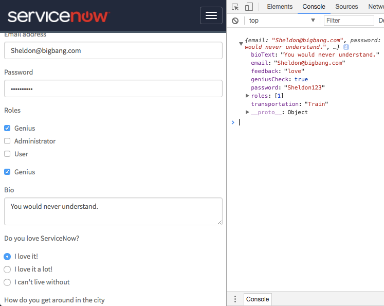

## Form Formly

## Description

This widget shows an alternative approach to build a form, adapting it to the type of content it has in input. It is based on Formly as main dependency. 
The submit button will send all the input data in JSON format. 

## Screenshots

 
## Additional Information/Notes
> None
---
## Installation
---
Download and install update set **[pe-form-formly.u-update-set.xml](pe-form-formly.u-update-set.xml)**   
After installation, the widget can be accessed via the `Service Portal > Widgets` section for use and customization. 
* SN Product Documentation - ['Load a customization from a single XML file'](https://docs.servicenow.com/search?q=Load+a+customization+from+a+single+XML+file)   (<i>Select appropriate instance version</i>)
---
## Configuration
---
Widget Option Schema parameters: 

**"Form Fields"** Input JSON representing the form. 

---
## Platform Dependencies
---
> None
---
## Sample Data and Data Structures

    [
      {
        "key": "email",
        "type": "input",
        "templateOptions": {
          "type": "email",
          "label": "Email address",
          "placeholder": "Enter email"
        }
      },
      {
        "key": "password",
        "type": "input",
        "templateOptions": {
          "type": "password",
          "label": "Password",
          "placeholder": "Password"
        }
      },
      {
        "key": "roles",
        "type": "multiCheckbox",
        "templateOptions": {
          "label": "Roles",
          "options": [
            {
              "id": 1,
              "title": "Genius"
            },
            {
              "id": 2,
              "title": "Administrator"
            },
            {
              "id": 3,
              "title": "User"
            }
          ],
          "valueProp": "id",
          "labelProp": "title"
        }
      },
      {
        "key": "geniusCheck",
        "type": "checkbox",
        "templateOptions": {
          "label": "Genius"
        }
      },
      {
        "key": "bioText",
        "type": "textarea",
        "templateOptions": {
          "label": "Bio"
        }
      },
      {
        "key": "feedback",
        "type": "radio",
        "templateOptions": {
          "label": "Do you love ServiceNow?",
          "options": [
            {
              "name": "I love it!",
              "value": "love"
            },
            {
              "name": "I love it a lot!",
              "value": "lovealot"
            },
            {
              "name": "I can't live without",
              "value": "extremelove"
            }
          ]
        }
      },
      {
        "key": "transportation",
        "type": "select",
        "templateOptions": {
          "label": "How do you get around in the city",
          "valueProp": "name",
          "options": [
            {
              "name": "Car"
            },
            {
              "name": "Helicopter"
            },
            {
              "name": "Sport Utility Vehicle"
            },
            {
              "name": "Bicycle",
              "group": "low emissions"
            },
            {
              "name": "Skateboard",
              "group": "low emissions"
            },
            {
              "name": "Walk",
              "group": "low emissions"
            },
            {
              "name": "Bus",
              "group": "low emissions"
            },
            {
              "name": "Scooter",
              "group": "low emissions"
            },
            {
              "name": "Train",
              "group": "low emissions"
            },
            {
              "name": "Hot Air Baloon",
              "group": "low emissions"
            }
          ]
        }
      }
    ]
---
## API Dependencies
<i>Dependencies are included and configured as part of the provided Update Set.</i>
> None
---
## CSS/SASS Variables
The widget is using colors from Bootstrap SASS variables, and a minimal styles configuration to make it easy to customize and extend.
_CSS/SASS variables are given default values that can be overridden with theming or portal-level CSS._
