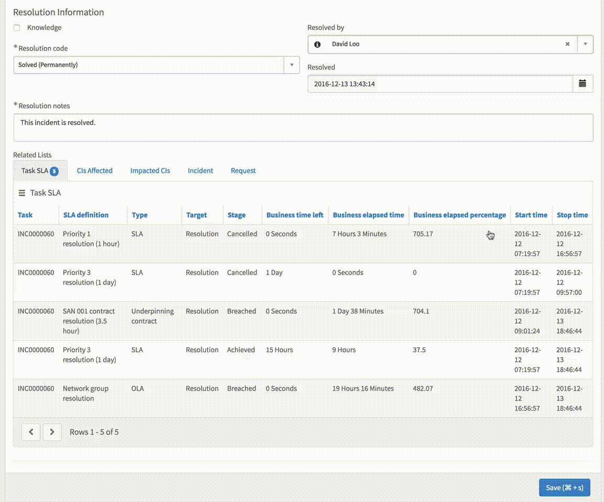

# Form with Inline Editing Related List

## Description
This is a drop-in replacement of the out of the box Form widget. This widget works with conjunction with another 2 widets. Please reference them for a full understanding of its functionality.

* Embeded Widget #1: [Related List](https://github.com/platform-experience/serviceportal-widget-library/blob/master/pe-related-list)
* Embeded Widget #2: [Inline Editing Data Table](https://github.com/platform-experience/serviceportal-widget-library/blob/master/pe-inline-editing-data-table)

## Screenshot

## Additional Information/Notes

For inline editing, make sure the field you want to edit is available in the form (sp view), otherwise you wont be able to edit it inline.

## Installation

Download and install update set **[pe-form-with-related-list.u-update-set.xml](https://github.com/platform-experience/serviceportal-widget-library/blob/master/pe-form-with-related-list/pe-form-with-related-list.u-update-set.xml)**

After installation, the widget can be accessed via the `Service Portal > Widgets` section for use and customization.

* SN Product Documentation - ['Load a customization from a single XML file'](https://docs.servicenow.com/bundle/kingston-application-development/page/build/system-update-sets/task/t_SaveAnUpdateSetAsAnXMLFile.html)

## Configuration

### Widget Option Schema

| Option | Description | Default Value |
| :--- | :--- | :--- |
| `Inline Editing` | Enable inline editing for related list   | false |

## Platform Dependencies

### SN System Tables

> None

## Sample Data and Data Structures

> See 'Configuration' above

## Dependencies _(included)_
* [Related List](../pe-related-list)
* [Inline Editing Data Table](../pe-inline-editing-data-table)

## CSS/SASS Variables

_CSS/SASS variables are given default values that can be overridden with theming or portal-level CSS._

> None