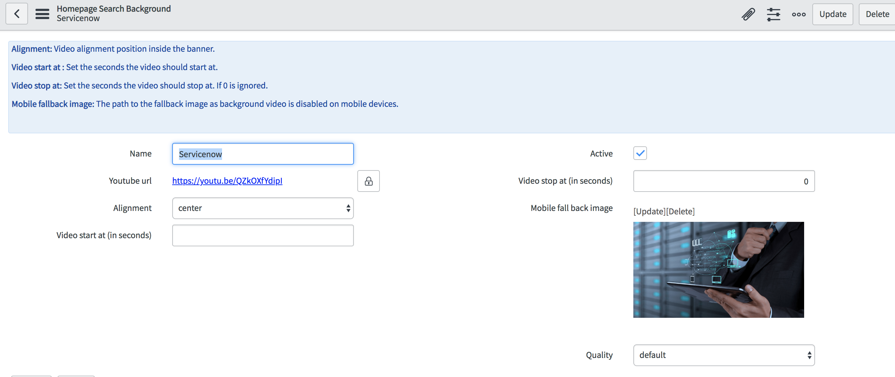
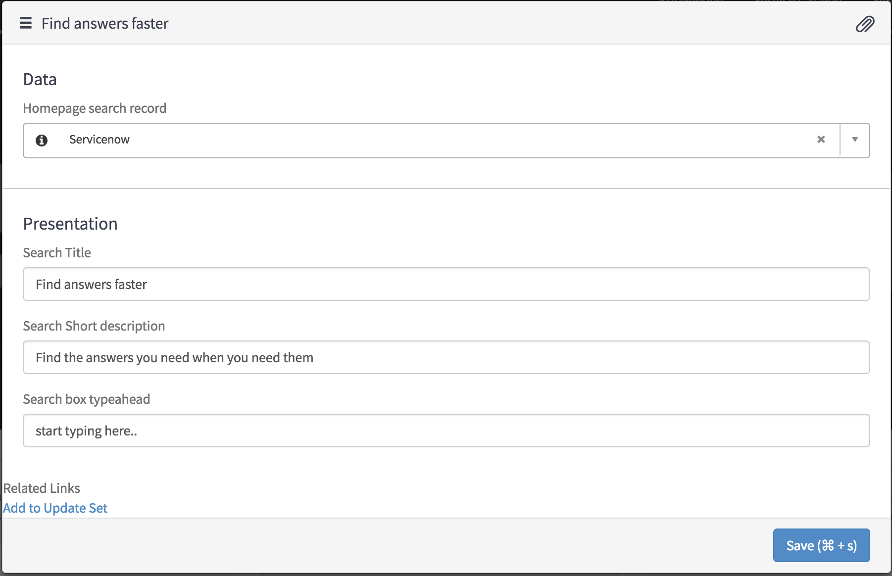

# PE Homepage Search with video

## Description

Create a cool homepage search banner with video.

## Screenshot

## Installation

Download and install update set **[pe-homepage-search-with-video.u-update-set.xml](https://github.com/platform-experience/serviceportal-widget-library/blob/master/pe-homepage-search-with-video/pe-homepage-search-with-video.u-update-set.xml)**

After installation, 1 new widgets **Homepage Search with video** can be accessed via the `Service Portal > Widgets` section for use and customization.

* SN Product Documentation - ['Load a customization from a single XML file'](https://docs.servicenow.com/bundle/kingston-application-development/page/build/system-update-sets/task/t_SaveAnUpdateSetAsAnXMLFile.html)

## Configuration

After committing the update set, Navigate to Homepage Search with video\Homepage Search Backgrounds and click on record named **Servicenow** this is provided to you as an example.

* Give it a name
* Add the youtube video link URL
* Optionally set the **Alignement** of the video within the banner For example if you set this value to center, the banner will be aligned to the center.
* Optionally set the **Video start at** and **Video stop at**, here you can specify the value in seconds, where you want to start and stop the video from.
* Set the **Mobile fall back image**, to optimize the portal on mobile devices, video is disbaled, so instead of video, this image will be displayed.
* Set the quality to your choice.
* Now you should be able to choose this record from widget options.

### Widget Option Schema

| Option | Description |
| :--- | :--- |
| `Homepage search record` | Choose the record which you want to use as background. |
| `Search Title` | Bigger text above search box. |
| `Search Short description` | The smaller short description below bigger text. |
| `Search box typeahead` | The default text displayed inside search box |

## Platform Dependencies

### Custom Tables

> x_snc_homepage_sea_x_snc_homepage_search_background

## Sample Data and Data Structures

> See 'Configuration' above

## Dependencies

## CSS/SASS Variables

