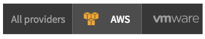
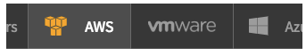

# Tabs Selector

## Description

This widget can be used to quicly show a list of tabs, managin selection and with horizontal scrolling.

## Screenshots
### No tab selected

### Tab selected

### Horizontal scrolling

## Additional Information/Notes
> None
---
## Installation
---
Download and install update set **[pe-horizontal-scroll-menu.u-update-set.xml](https://github.com/platform-experience/serviceportal-widget-library/blob/master/pe-horizontal-scroll-menu/pe-horizontal-scroll-menu.u-update-set.xml)**   
After installation, the widget can be accessed via the `Service Portal > Widgets` section for use and customization. 
* SN Product Documentation - ['Load a customization from a single XML file'](https://docs.servicenow.com/bundle/jakarta-application-development/page/build/system-update-sets/task/t_SaveAnUpdateSetAsAnXMLFile.html)

---
## Configuration
---
Widget Option Schema parameters:

**"Title"** Card Title `Default: All providers`

---
## Platform Dependencies
---
> None
---
## Sample Data and Data Structures
---
Sample data is provided as JSON objects in the Server Script.

---
## API Dependencies
---
<i>Dependencies are included and configured as part of the provided Update Set.</i>
> None
---
## CSS/SASS Variables
---
_CSS/SASS variables are given default values that can be overridden with theming or portal-level CSS._

`$pe-tabs-selector-bg-color: #373737 !default;` 
`$pe-tabs-selector-bg-active-color: #4d4d4d !default;` 
`$pe-tabs-selector-text-color: #9c9c9c !default;` 
`$pe-tabs-selector-text-active-color: #fff !default;` 