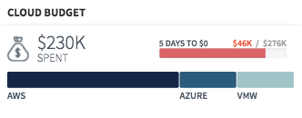

## Synopsis: Horizontal Staked Bar




This widget can be used to create a simple approval card with three button **Accept**, **Reject**, **View**. This widget also displays user avatar, name and title etc.

***

## Installation

Installation is very simple, you can just download the update set **pe-horizontal-stacked-bar-update-set.xml** and install it on your instance. Then the widget is available for you to drag and drop on your page.

We provide a single option to make easy to build the stacked bar graph:

**"Graph Data"** the default message for this is a sample JSON object.

```javascript
    [
      {
          "width":"60%",
          "color":"rgb(19, 35, 71)",
          "info_text":"AWS",
          "info_number":""
      },
      {
          "width":"20%",
          "color":"rgb(28, 91, 125)",
          "info_text":"AZURE",
          "info_number":""
      },
      {
          "width":"20%",
          "color":"rgb(150, 198, 200)",
          "info_text":"VMW",
          "info_number":""
      }
    ]
```

***

We provide four SASS variables to control the chat and call icon colors.

`$pe-brand-primary:#337ab7 !default;`

You can override these variables at portal level using the **themes**.


