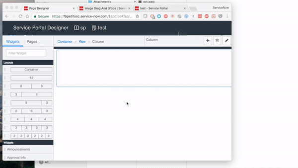

# Image Drag & Drop Upload Widget

## Description

This widget can be used to upload one or more images (with the help of the ServiceNow attachments functionality) into a default or custom table defined in the widget options.

## Screenshot

 <br/><br/>

## Additional Information/Notes

> None

## Installation

Download and install update set **[pe-image-drag-and-drop.u-update-set.xml](https://github.com/platform-experience/serviceportal-widget-library/blob/master/pe-image-drag-and-drop/pe-image-drag-and-drop.u-update-set.xml)** <br/><br/>
After installation, the widget can be accessed via the `Service Portal > Widgets` section for use and customization.<br/>
* SN Product Documentation - ['Load a customization from a single XML file'](https://docs.servicenow.com/bundle/kingston-application-development/page/build/system-update-sets/task/t_SaveAnUpdateSetAsAnXMLFile.html)

## Configuration

Language variants can be created through the section System UI -> UI Messages and displayed adding in the HTML body a statement with the syntax:

```
${<i>key value specified in the Message record</i>}
```

### Widget Option Schema

| Option | Description | Default Value |
| :--- | :--- | :--- |
| `Table` | The table containing the products/items to search for. | u_image_drag_and_drop |
| `Field Name` | The column name with the value to display on the UI. | u_name |

## Platform Dependencies

## Sample Data and Data Structures

> See 'Configuration' above

## API Dependencies

* DropzoneJs <br/>
<i>Dependencies are included and configured as part of the provided Update Set.</i>

## CSS/SASS Variables

The widget is using colors from Bootstrap SASS variables, and a minimal style configuration to make it easy to customize.
_CSS/SASS variables are given default values that can be overridden with theming or portal-level CSS._
