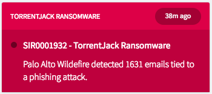

## Title - Incident Message

## Description - Use Case

This widget can be used to quickly craft an incident message or alert with configurable options.

## Screenshots

## Additional Information/Notes 
> None
---
## Installation
---
Download and install update set **[pe-incident-message.u-update-set.xml](pe-incident-message.u-update-set.xml)**   
After installation, the widget can be accessed via the `Service Portal > Widgets` section for use and customization. 
* SN Product Documentation - ['Load a customization from a single XML file'](https://docs.servicenow.com/search?q=Load+a+customization+from+a+single+XML+file)   (<i>Select appropriate instance version</i>)
---
## Configuration
---
Widget Option Schema parameters:

**"Title"** This is for changing the title in the panel header. 
**"Message Time"** This is for displaying the incident message time. 
**"Message Header"** This is for displaying the message header in the panel body. 
**"Message Body"** This is for displaying the message body in the panel body. 

---
## Platform Dependencies
---
> None
---
## Sample Data and Data Structures
---
Sample data is provided as JSON objects in the Server Script.

---
## API Dependencies
---
<i>Dependencies are included and configured as part of the provided Update Set.</i>
> None
---
## CSS/SASS Variables
---
_CSS/SASS variables are given default values that can be overridden with theming or portal-level CSS._

`$pe-status-color-danger: #6b0022 !default;` 
`$pe-badge-danger: #a40034 !default;` 
`$pe-background-header-danger: #dd0047 !default;` 
`$pe-background-body-danger: #be003d !default;` 