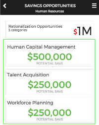
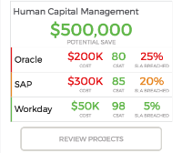
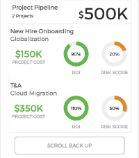

## Title - Business Unit Details (ITBM Experience)

## Description - Use Case

This widget provides the ability to cascade multiple panels of information and relevant data across small form factor elements.

## Screenshots
<table><tr style='vertical-align:top'><td>

### Collapsed

</td><td>

### Expanded

</td><td>

### Expanded Details

</td></tr></table>

## Additional Information/Notes 
> None
---
## Installation
---
Download and install update set **[pe-itbm-business-unit-details.u-update-set.xml](pe-itbm-business-unit-details.u-update-set.xml)**   
After installation, the widget can be accessed via the `Service Portal > Widgets` section for use and customization. 
* SN Product Documentation - ['Load a customization from a single XML file'](https://docs.servicenow.com/search?q=Load+a+customization+from+a+single+XML+file)   (<i>Select appropriate instance version</i>)
---
## Configuration
---
Widget Option Schema parameters:
> None
---
## Platform Dependencies
---
> None
---
## Sample Data and Data Structures
---
There are two types of sample data sets provided and included in the Server Script file.  
 First, the data set that is used to build the multiple panels. 
 And, the data set - chartOptions - used to build the two donut charts (ROI and RISK SCORE).
 Both are included as part of the Server Script file.

---
## API Dependencies
---
<i>Dependencies are included and configured as part of the provided Update Set.</i>

* HighCharts API (v 5.0.5 - Recommended)  w/Export and No Data plug-ins
   Latest version(s) available from [HighCharts.com](http://http://www.highcharts.com/products/highcharts/)
   Additional HighCharts Utility - [highcharts-ng](https://github.com/pablojim/highcharts-ng) - Angular Directive for HighCharts (__not used or distributed__)
---
## CSS/SASS Variables
---
_CSS/SASS variables are given default values that can be overridden with theming or portal-level CSS._

`$bud-font-color: #65666A !default;` 
`$bud-font-softcolor: #b4b2b3 !default;` 
`$bud-background-color: #FFFFFF !default;` 
`$bud-border-color: #E4E5E6 !default;` 
`$bud-btn-border: #DBDAD6 !default;` 
`$bud-red: #e51b24 !default;` 
`$bud-orange: #e89033 !default;` 
`$bud-green: #70BE5A !default;` 