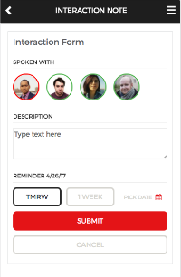
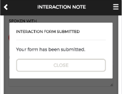

## Title - Interaction Note Form (ITBM Experience)

## Description - Use Case

The widget provides and interactive form for capturing notes or reminder for posting back to an instance table/list.

## Screenshots
<table><tr style='vertical-align:top'><td>

### Interactive Form

</td><td>

### Message after Submit

</td></tr></table>

## Additional Information/Notes 
This widget is reliant upon a System User Group in order to display the 'SPOKEN WITH' section of the widget.
The System User Group can be set in the Widget Options Schema or hard coded in the Server Script.

---
## Installation
---
Download and install update set **[pe-itbm-interaction-note.u-update-set.xml](pe-itbm-interaction-note.u-update-set.xml)**   
After installation, the widget can be accessed via the `Service Portal > Widgets` section for use and customization. 
* SN Product Documentation - ['Load a customization from a single XML file'](https://docs.servicenow.com/search?q=Load+a+customization+from+a+single+XML+file)   (<i>Select appropriate instance version</i>)
---
## Configuration
---
Widget Option Schema parameters:

**Group Name** Name of the System User Group `Default: Test Group`
**Card Title** Cart Title `Default: Interaction Form`

---
## Platform Dependencies
---
> None
---
## Sample Data and Data Structures
---
> See 'Configuration' above
---
## API Dependencies
---
<i>Dependencies are included and configured as part of the provided Update Set.</i>
> None
---
## CSS/SASS Variables
---
_CSS/SASS variables are given default values that can be overridden with theming or portal-level CSS._

`$inf-font-color: #2E2E2E !default;` 
`$inf-font-softcolor: #65666A !default;` 
`$inf-font-notselected: #c2c2c2 !default;` 
`$inf-background-color: #ffffff !default;` 
`$inf-border-color: #E4E5E6 !default;` 
`$inf-red: #E51B24 !default;` 
`$inf-black: #000000 !default;` 
`$inf-white: #ffffff !default;` 
`$inf-green: #57B957 !default;` 